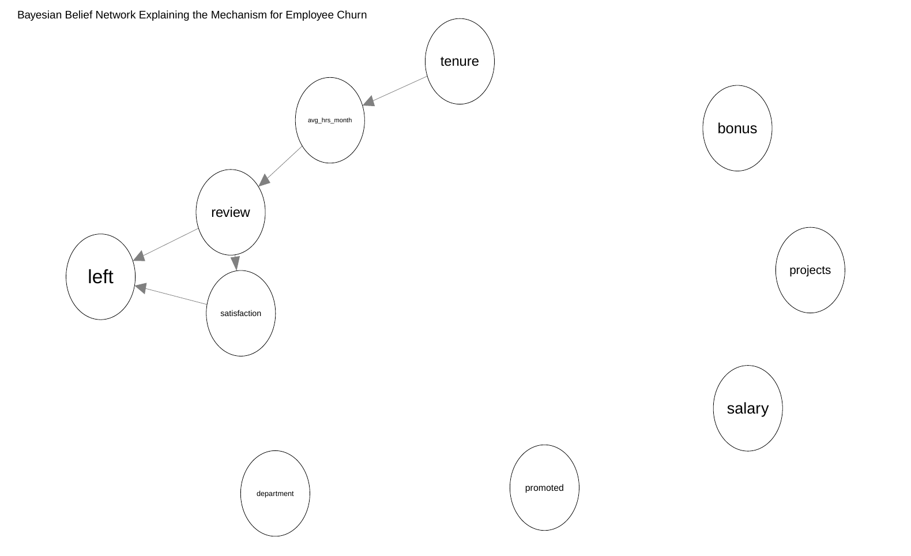
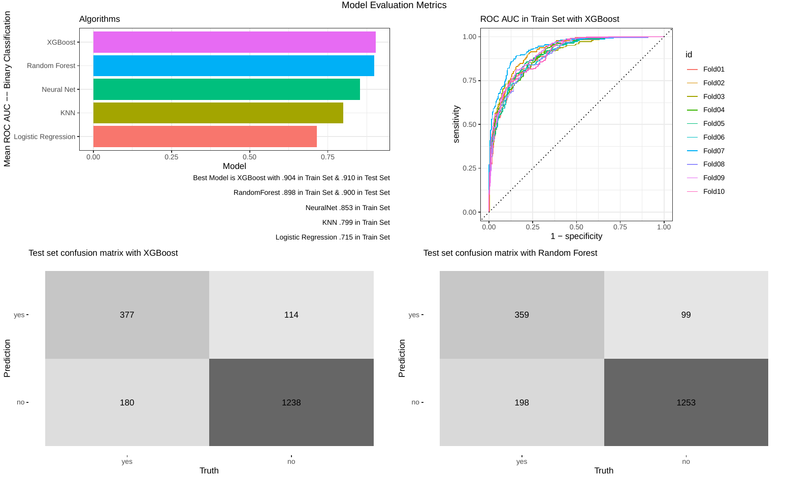

# Employee Turnover

The project is from DataCamp's Can you help reduce employee turnover? (See [https://app.datacamp.com/learn/competitions/reducing-employee-turnover](https://app.datacamp.com/learn/competitions/reducing-employee-turnover))

The company is worried about the relatively high turnover; the project's goal is to understand the reasons for the churn, surface relevant insights from the data and come up with a predictive model.

My analysis includes EDA, causal analysis, and finding the best predictive model for the churn.

With Bayesian learning network, I discover that the years of experience in the company determines the average monthly hours of work, which in turn impacts employees' review score by the company. Review score directly causes the employee churn, together with employees' satisfaction score.

Judged by the mean ROC AUC, the best predictive model is XGBoost (with .90 in train-set & .91 in test-set).

